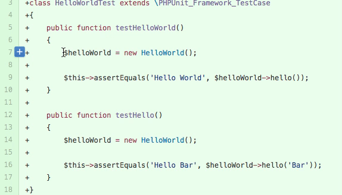

# HubLighter - The GitHub Code Highlighter

Simple extension to help with GitHub code reviews.

Having trouble finding code occurrences in new code while checking pull request? 
Highlight variable/function/anything and all occurrences will be highlighted for easier tracking. 

Doesn't require any special permission and works on any GitHub project, even if you are not logged in into GitHub account.

## What it Does?

Finds and highlights any occurrence of selected text.

Hublighter in action:

## How to use?

1. Install extension in Chrome (duh, obviously).
2. Open any pull request or source page on GitHub.
3. Select text that needs to be highlighted (double-click select also works).
4. Double-click to remove highlight or to highlight new text.

## Disclaimer

_Code Highlighter for GitHub_ extension is not endorsed by, sponsored by, or affiliated with GitHub.

---

## Version History

### 1.1.1

* Reformat and polish

### 1.1.0

* Added options page: 
  * Background color
  * Text color
  * Use border flag
  * Border color

### 1.0.0
Initial (also known as The Glorious One).

---

## TODO and Wishlist

* Settings page with fancy color-picker.
* Go to next/previous occurrence.
